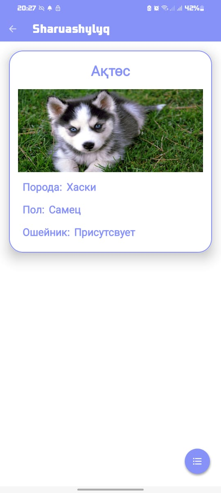

<!DOCTYPE html>
<html lang="en">

<head>
    <meta charset="UTF-8">
    <meta name="viewport" content="width=device-width, initial-scale=1.0">
</head>

<body>

  <h1>Sharuash Android Application Documentation</h1>

  <h2 id="introduction">1. Introduction</h2>

  
The Sharuashylyq Android Application is a comprehensive solution designed to address the global issue of missing pets. Developed by students of the Nazarbayev Intellectual School of Physics and Mathematics in Semey, Kazakhstan, this project aims to enhance pet safety, facilitate emergency response, monitor pet activity and health, provide pet care advice, and contribute to various industries and sectors.

   <h2 id="project-overview">2. Project Overview</h2>

   <h3 id="features">Features</h3>
    <ul>
        <li><strong>Authentication via Phone Number</strong></li>
        <li><strong>Storage of Animal Data</strong></li>
        <li><strong>Displaying Location of Veterinary Clinics</strong></li>
        <li><strong>Pet Location Tracking via Collar</strong></li>
        <li><strong>Animal Care Tips Section</strong></li>
        <li><strong>AI-Based Chatbot</strong></li>
        <li><strong>Settings section</strong></li>
    </ul>

   <h2 id="getting-started">3. Getting Started</h2>

   <h3 id="prerequisites">Prerequisites</h3>
    <ul>
        <li>Android device running Android 5.0 (Lollipop) and above.</li>
        <li>Internet connectivity.</li>
        <li>Mobile phone with a valid phone number.</li>
    </ul>

   <h3 id="installation">Installation</h3>
    <ol>
        <li>Download the Sharuash APK from <a href="https://github.com/A5an/Sharuash.git">GitHub Repository</a>.</li>
        <li>Enable installation from unknown sources in device settings.</li>
        <li>Install the application.</li>
    </ol>

  <h2 id="usage">4. Usage</h2>

  <h3 id="authentication">Authentication</h3>
    
Users authenticate via phone number for secure access to the application.

    

    
         

  <h3 id="pet-information">Pet Information</h3>
    
Store and manage your pet's information, including photo, name, gender, and collar presence.

    
         
     

  <h3 id="location-services">Location Services</h3>
    <ul>
        <li><strong>Veterinary Clinics:</strong> View nearby veterinary clinics.</li>
        <li><strong>Pet Location Tracking:</strong> Monitor your pet's location using the smart collar and GPS module.</li>
    </ul>

    

   <h3 id="animal-care-tips">Animal Care Tips</h3>
    
Access a section with various tips on caring for animals.

    
         

  <h3 id="ai-based-chatbot">AI-Based Chatbot</h3>
    
Engage with an AI-based chatbot for personalized advice on pet care and general animal husbandry.

    

  <h3 id="technical-support">Settings section</h3>
    
Section for users to configure the app and dedicated technical support.

    

   <h2 id="conclusion">5. Conclusion</h2>

  
The Sharuash Android Application effectively addresses the issue of missing pets, providing innovative solutions for pet care and loss prevention.

  
</body>

</html>
